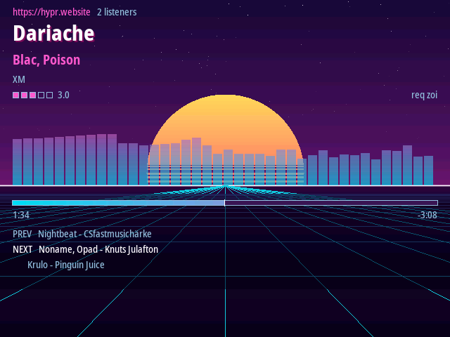
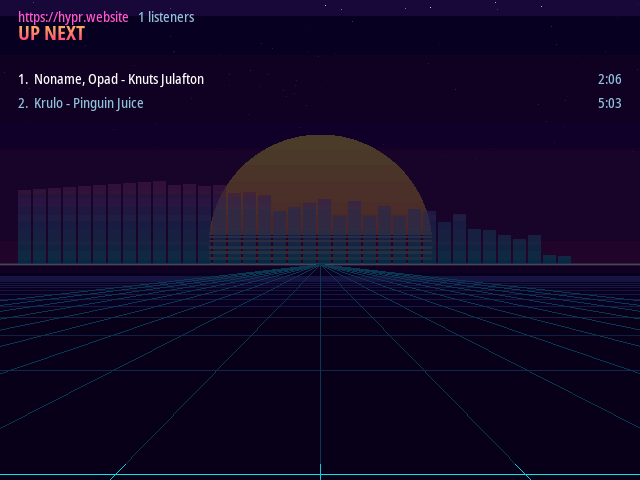

# HYPR demoscene radio

An 80s-vaporwave internet-radio client for the **Miyoo Mini Plus** running **OnionOS**,
playing [hypr.website](https://hypr.website).

The backend broadcasts far more than a stream title over its WebSocket: now-playing
metadata, the upcoming queue, recently-played history, average ratings, listener counts
and per-song timing. This turns a handheld into a dedicated appliance for it — endless
perspective grid, scanline sun, chrome text, spectrum analyser.

## Screenshots

Captured live from `wss://hypr.website/ws` on the host build.




## Building

```sh
make deps          # fetch + build third-party sources (once)
make               # host build, for development
make test          # unit tests
make SANITIZE=1 test   # ...under ASan/UBSan
```

For the device, install the cross-toolchain once:

```sh
./tools/fetch-toolchain.sh   # ~267MB, installs to ~/.local/share/miyoomini-toolchain
make TARGET=device
make package                 # dist/App/Hypr      -> copy to /mnt/SDCARD/App/
make package-probe           # dist/App/HyprProbe -> one-off hardware probe
```

This is the same GCC 8.3 toolchain the
[union toolchain](https://github.com/shauninman/union-miyoomini-toolchain) image wraps,
extracted directly rather than through Docker — the image only ever downloads and
unpacks a self-contained tarball, so the container buys nothing here and fails outright
where Docker networking is restricted. If you already have the container, it exports
`CROSS_COMPILE` and the build picks that up instead.

The old GCC matters: the device's buildroot userland is **glibc 2.28**, and the toolchain
sysroot targets exactly that. A modern host cross-compiler would emit binaries the device
cannot load. `hypr` requires at most `GLIBC_2.28` (one symbol, `fcntl`), which is the
ceiling rather than over it — worth re-checking with `readelf -V` if you ever swap
toolchains.

The packaged app links only `libSDL-1.2.so.0`, `libpthread`, `libm` and `libc`; its
bundled `lib/` is empty by design, since mbedTLS is static and SDL comes from the device.

## Design notes

Two linking decisions are deliberate and easy to "fix" wrongly:

- **SDL 1.2 is linked dynamically** against the copy OnionOS already ships at
  `/mnt/SDCARD/miyoo/lib`. That build is patched to drive the SigmaStar MI_GFX/MI_AO
  blocks and handle the physically rotated panel; bundling our own would lose all of it.
  The 1.2.15 ABI is frozen, so this is stable across Onion releases.
- **mbedTLS is linked statically** from our own pinned build. The device does ship
  `libmbedtls.so.10`, but it is 2.x and drifts between Onion releases. ~300KB buys
  immunity to that, and means the desktop and device targets link an identical API.

Other things worth knowing before changing code:

- **The device has no battery-backed RTC.** `time(NULL)` is arbitrary until NTP runs.
  Everything that measures elapsed time uses `mono_ms()`, and song progress is derived
  from a server clock offset estimated over the WebSocket ping/pong round-trip.
- **The audio stream arrives chunked.** nginx re-frames the Icecast stream as
  `Transfer-Encoding: chunked`; `src/net/http.c` strips that. Feeding chunk-length
  lines to an MP3 decoder produces periodic clicks rather than an obvious failure.
- **The CA bundle holds roots only** (ISRG Root X1 and X2, ~3KB). Never pin
  intermediates — Let's Encrypt rotates them and the app would break on renewal.

## Development without hardware

`conn_open_memory()` in `src/net/conn.c` is the seam the offline harness is built on:
it backs a connection with a buffer instead of a socket, and bounds how much each read
returns so parsers are forced to handle records split across read boundaries.

```sh
# Validate TLS + chunked de-framing against the live backend
./build/desktop/bin/streamdump --url https://hypr.website/hypr.mp3 --seconds 10 --out /tmp/a.mp3
ffprobe /tmp/a.mp3
```

## License

Copyright 2026 HYPR Demoscene Radio. Licensed under the Apache License, Version 2.0 —
see [LICENSE](LICENSE).

Bundled third-party code keeps its own terms: [minimp3](third_party/minimp3/) is
public domain (CC0) and [cJSON](third_party/cJSON/) is MIT.
